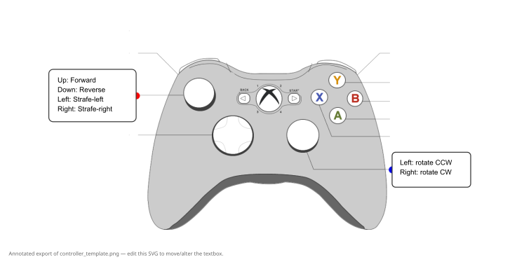

# CompBot2026

Small FRC robot codebase (Java, WPILib, GradleRIO) for Team 159 — swerve drive example.

Quick start (Git Bash / Unix shell)

```bash
# build the robot
./gradlew build

# deploy artifact + files under src/main/deploy to the RoboRIO
./gradlew deploy

# list available Gradle tasks (useful to find simulation tasks)
./gradlew tasks

# run tests (this repo currently has no test sources)
./gradlew test
```

Where to look
- `src/main/java/frc/robot/Robot.java` — TimedRobot lifecycle
- `src/main/java/frc/robot/RobotContainer.java` — subsystem wiring, default commands, SmartDashboard chooser
- `src/main/java/frc/robot/subsystems/Drivetrain.java` — swerve kinematics, odometry, field-oriented toggle
- `src/main/java/frc/robot/subsystems/SwerveModule.java` — per-wheel PID control and encoder offsets
- `src/main/java/frc/robot/commands/DriveWithGamepad.java` — default teleop driving
- `src/main/java/frc/robot/objects/` — hardware abstraction (Motors, Encoders, Gyro)
- `src/main/deploy/pathplanner` — pathplanner assets copied to the RoboRIO on deploy

Notes for contributors
- Robot constants (CAN IDs, module offsets) live in `Constants.java`. Update that file when changing hardware mappings.
- Inspect `frc.robot.objects` before changing motor/encoder behavior — these are the hardware abstraction layer.
- The project uses GradleRIO (see `build.gradle`). Simulation is enabled in `build.gradle` (wpi.sim) — check available Gradle tasks with `./gradlew tasks`.

If you'd like, I can expand this README with team number, simulation run commands, or troubleshooting tips.

Controller mapping (annotated diagram)

The annotated controller diagram is available at `docs/xbox-controller.png` and shows the current control mappings used by the code. If you want to edit the base artwork, the editable bitmap template remains at `docs/controller_template.png` and the vector overlay is in `docs/xbox-controller-overlay.svg`.



Notes:
- The editable PNG template is `docs/controller_template.png` and the overlay SVG used to generate the annotated PNG is `docs/xbox-controller-overlay.svg`.
- `DriveWithGamepad.java` reads the left stick for vx/vy (drive) and the right stick X for rotation. The right-stick-button toggles field-oriented mode.
